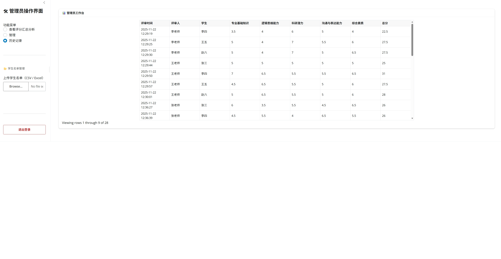
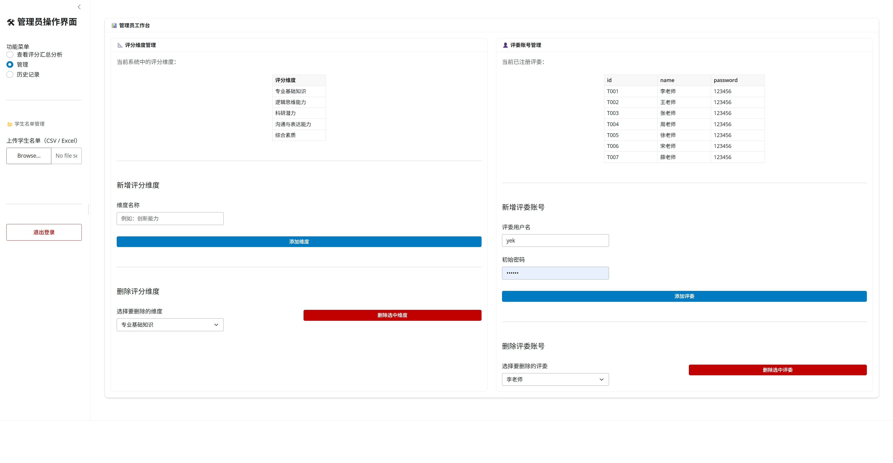
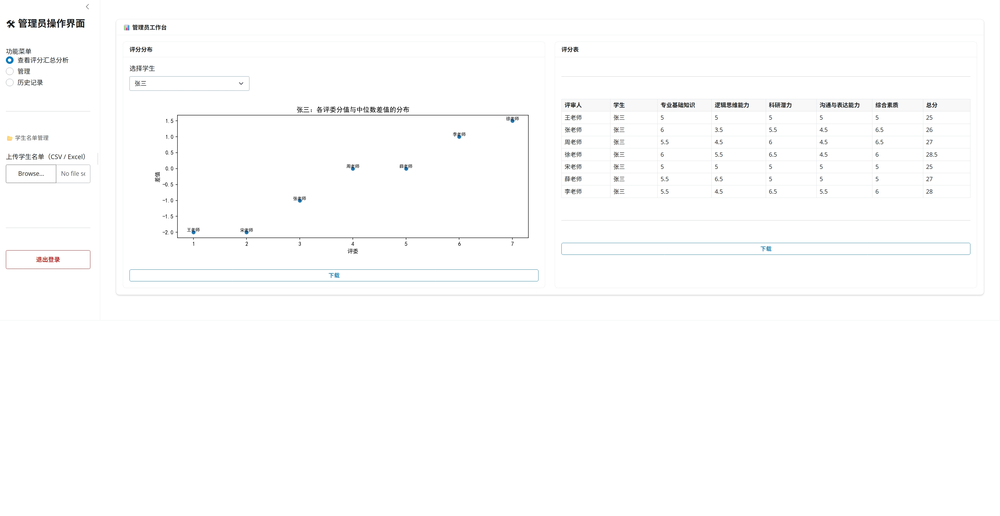
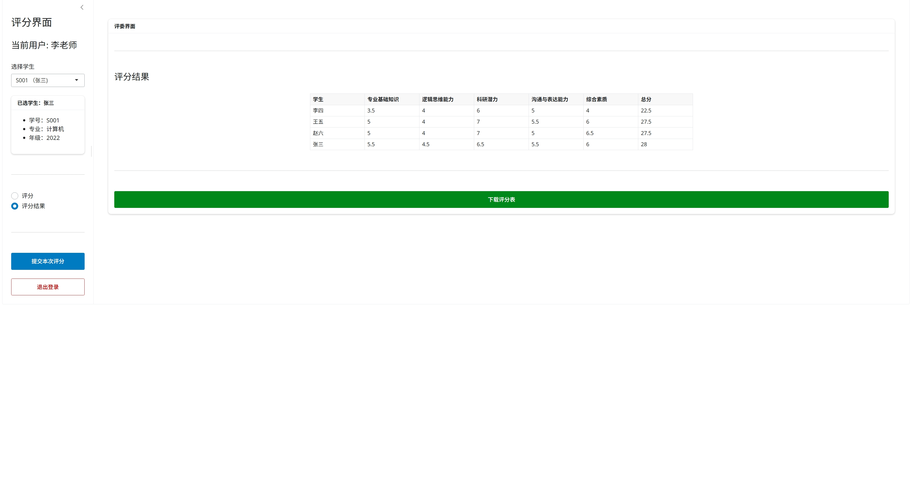
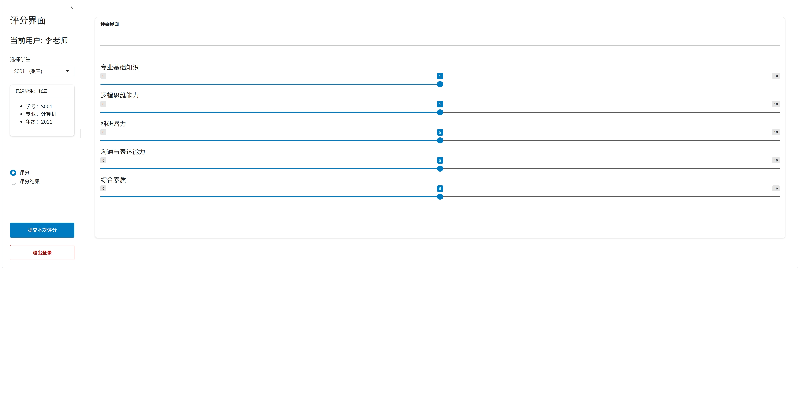

# 专家评分系统

## 项目简介
基于Shiny for Python和MySQL实现的专家评分系统。使用Shiny for Python构建前端和服务器逻辑，用MySQL来存储和管理数据
支持
> 1.评委和管理员登录
> 2.管理员可以添加和删除评分维度
> 3.管理员可以添加和删除评委
> 4.管理员可以上传学生名单
> 5.管理员可以查看所有评委评分的历史纪录
> 6.管理员可以查看各评委的分值与此生各评委分值中位数差值的分布
> 7.评委可以选择学生对其各维度进行评分
> 8.可以根据分值排序
> 9.可以下载表格或图像
## 目录结构

| 文件/目录              | 描述                                  |
| ------------------ | ----------------------------------- |
| `main.py`          | Shiny应用启动入口       |
| `server_.py`       | 实现后端逻辑           |
| `login_ui.py`      | 登录界面UI: 支持评委和管理员两种登录方式        |
| `judger_ui.py`     | 评委端界面UI: 选择学生、评分、查看评分结果并导出             |
| `root_ui.py`       | 管理员端界面UI: 查看评分汇总、管理维度和评委、上传学生名单、查看历史记录 |
| `initializeDB.py`  | 空白初始化数据库                     |
| `exampleDB.py`     | 用 `example/` 中的示例数据来初始化数据库，以便快速体验          |
| `config.py`        | 数据库连接配置               |
| `example/`         | 示例数据，包括学生名单、评委账号密码、管理员账号密码、评分历史和评分维度          |
| `images/`         | 项目展示用的图片         |
| `requirements.txt` | Python 依赖                         |
## 环境准备
### 1.安装依赖
使用python 3.10 以上版本，创建虚拟环境，执行:

``pip install -r requirements.txt``

### 2.配置数据库连接
编辑config.py文件，修改engine:

``from sqlalchemy import create_engine``
``engine = create_engine(``
``"mysql+pymysql://<用户名>:<密码>@<主机名>:<端口号>/<数据库名>?charset=utf8"``
``)``
将用户名 密码 主机名 端口号 数据库名 依次修改

### 3.初始化数据
#### 空白初始化 
直接运行initializeDB.py或在项目根目录下执行``python initializeDB.py``
#### 使用提供的示例初始化
直接运行exampleDB.py或在项目根目录下执行``python exampleDB.py``
## 启动Shiny应用
直接运行main.py或在项目根目录下执行``python main.py``
## 使用说明
如果是使用空白初始化 只提供了管理员账号和密码:

> 账号: 管理员
> 密码: 123456

后续可以通过管理员界面来上传学生名单，增删评分维度，增删评委

如果使用示例来初始化 提供了管理员账号和密码:

> 账号: 管理员
> 密码: 123456

并提供了学生名单。评委账号密码，评分记录，评分维度，详见`example/`

## 项目展示

 
 
 
 
 

